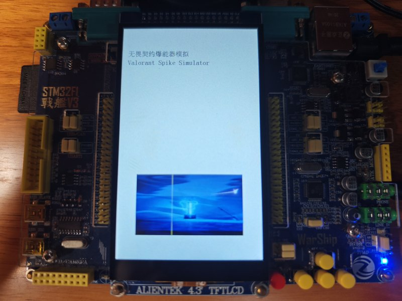
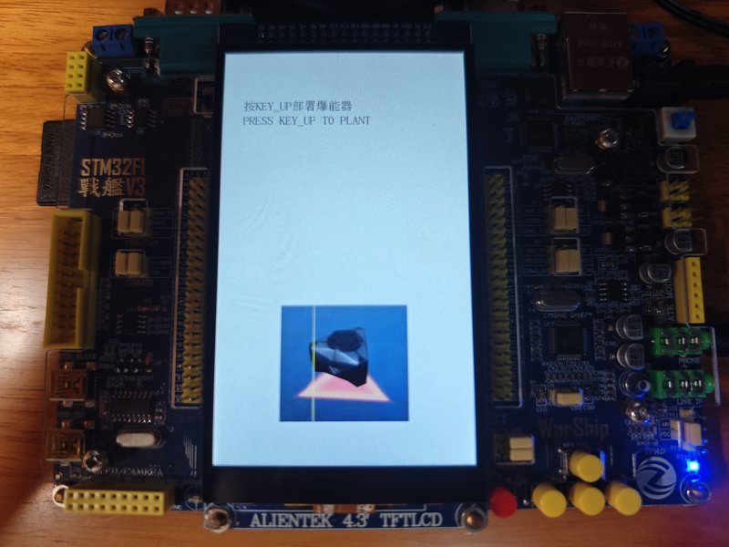
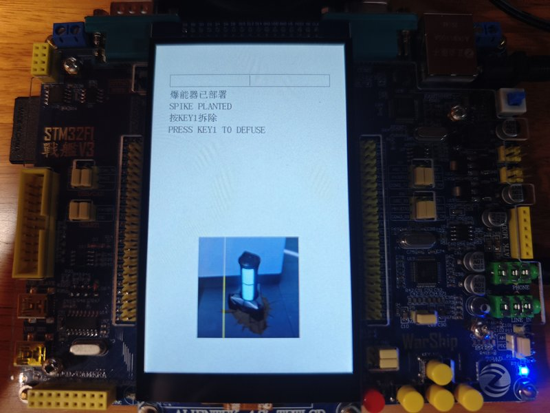
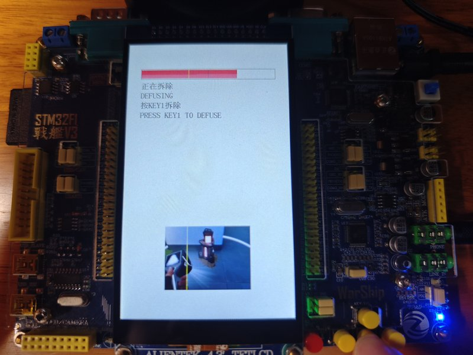
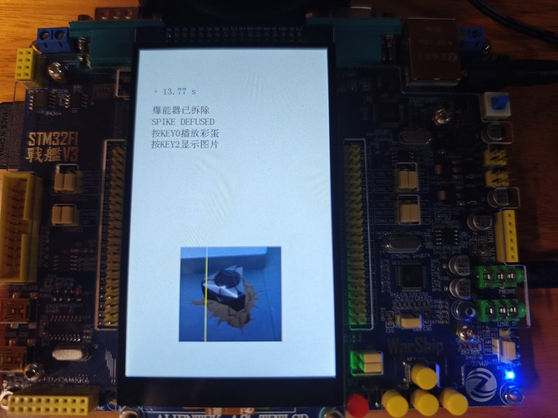
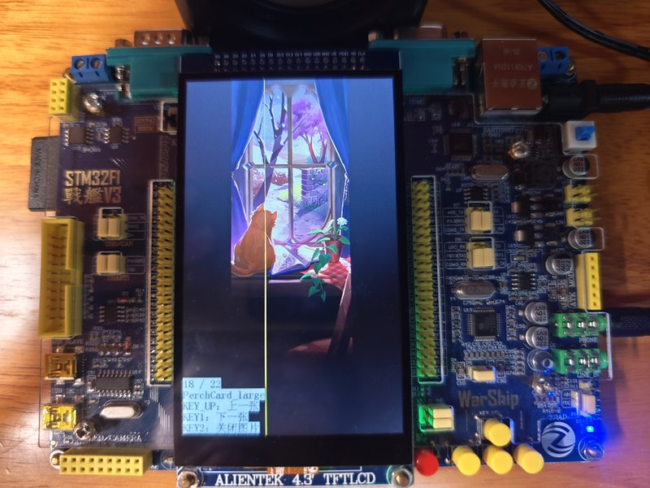

# Valorant Spike Simulator

> Simulates the Spike device from *Valorant* on an STM32 microcontroller — plant, defuse, detonate, with real-time countdown, LED blink patterns, LCD progress bars, audio feedback, and an easter egg system.
> Built on the **ALIENTEK Warship V3** development board (STM32F103ZET6).

[简体中文](./README.md)



> **Demo Video**: To be added

## Table of Contents

- [Gameplay](#gameplay)
- [Hardware](#hardware)
- [Peripheral Setup](#peripheral-setup)
- [Quick Start](#quick-start)
- [SD Card Layout](#sd-card-layout)
- [Program Features](#program-features)
- [Screenshots](#screenshots)
- [Controls](#controls)
- [Notes](#notes)
- [Code Structure](#code-structure)
- [Acknowledgments](#acknowledgments)
- [License](#license)

## Gameplay

This project simulates the classic Spike gameplay from *Valorant*: the attackers plant the Spike, and the defenders must defuse it within 45 seconds before it detonates.

**Boot Animation**: On power-up the system runs a silent self-check. The LCD shows a GIF animation for about 3 seconds, synced with a startup audio track. After the animation ends, the system enters the Undeployed state.

**Plant**: Hold KEY_UP. A planting progress bar fills from left to right. After 4 seconds the bar is full — the Spike is planted and the 45-second countdown begins. If you release early, planting is cancelled. If you held for less than 1 second, the planting sound continues until the 1-second mark, mimicking a "fake plant" in-game.

**Countdown**: Once planted, a 45-second planted audio track plays while the red LED blinks faster and faster. The LCD shows a defuse progress bar with a vertical midline.

**Defuse**: Hold KEY1 to enter the defusing state. The green LED lights up and the progress bar fills from its current position. The full defuse requires 7 seconds. However, if you hold for more than 3.5 seconds (past the 50% mark), that **50% is permanently saved** — no matter how many subsequent attempts fail, those 3.5 seconds are locked in, and your next attempt only needs another 3.5 seconds. Once the bar reaches 100%, the Spike is defused immediately.

**Defused**: The countdown stops and the remaining time is displayed. Press and release KEY0 to play a random easter egg audio clip. Release KEY0 again to switch to the next track.

  Let's gooooooo!

**Detonation**: If the 45 seconds expire before defusal completes, the screen shows how much additional defuse time would have been needed (if defusing was in progress) or nothing (if no defuse attempt was active). A detonation sound plays and the red LED stays solid. You can also trigger a different set of easter egg audio clips with KEY0.

**Picture Browser**: In the Defused or Detonated state, press and release KEY2 to enter picture browsing mode. The LCD displays BMP images from the `PICS/` directory on the SD card. Use KEY_UP/KEY1 to navigate and KEY2 to exit. Easter egg switching via KEY0 works independently while browsing.

## Hardware

| Component | Spec |
|-----------|------|
| Board | ALIENTEK Warship V3 |
| MCU | STM32F103ZET6 (Cortex-M3, 72 MHz) |
| Display | 4.3" TFT-LCD (480×272, FSMC) |
| Audio | VS1053B → TDA1308T → 3.5 mm PHONE jack |
| Storage | Micro SD card (SDIO + FatFS) |
| Debug/Flash | ST-LINK (SWD) |

## Peripheral Setup

- **SD Card**: Insert into the Micro SD slot on the side of the board (contacts facing down). Populate it with the file structure shown below before first use.
- **Speaker / Headphones**: Plug a 3.5 mm cable into the **PHONE** jack (not LINE_IN). If using USB-powered speakers, connect the USB cable to any 5 V power source.
- **Power**: The board requires a 12 V 1 A external power supply. The 4.3" LCD draws significant current; USB power alone may be insufficient.

## Quick Start

1. **Prepare the SD card**: Place all audio, font, and image files on a Micro SD card following the directory structure below, then insert it into the board
2. **Connect peripherals**: Plug headphones or speakers into the PHONE jack, connect the ST-LINK programmer and the 12 V power supply
3. **Open the project**: Launch Keil uVision5 and open `USER/ValorantSpike.uvprojx` with ARM Compiler v5 selected
4. **Build and flash**: `Build` → `Download` (or press F8) to write the program via ST-LINK
5. **Power on and run**: Press reset; the boot animation appears, followed by the main program

## SD Card Layout

```
SD:\
├── SOUNDS\
│   ├── planting.mp3
│   ├── planted.mp3
│   ├── defuse_start_1.mp3
│   ├── defuse_start_2.mp3
│   ├── defused.mp3
│   ├── boom.mp3
│   ├── startup\
│   │   └── startup.mp3
│   └── Easter_eggs\
│       ├── defused\        (success easter egg mp3s)
│       └── detonated\      (failure easter egg mp3s)
├── SYSTEM\
│   └── FONT\               (GBK12/16/24.FON + UNIGBK.BIN)
├── PICS\
│   ├── spike_pics\         (state indicator images, *.bin)
│   ├── startup\            (boot animation frames, all.bin)
│   └── *.bmp               (user pictures for the photo browser)
```

## Program Features

- **Fully non-blocking main loop**: LED blinking, LCD refresh, and audio streaming are driven by system ticks without any blocking delays
- **Time-synced audio resume**: When planted.mp3 is briefly paused for a defuse sound effect, playback resumes at a file offset proportional to elapsed countdown time, keeping audio and visuals always in sync
- **Permanent defuse progress lock**: Once past the 50% threshold, progress is never lost — return at any time and finish the remaining seconds
- **Picture decoding without audio interruption**: The PICTURE library's yield callback keeps feeding VS1053 data between decode passes
- **Chinese font hot-recovery**: At boot, the system checks font integrity in SPI Flash; if missing, it silently restores them from the SD card
- **Preloaded state indicator images**: 8 state pictures are loaded from the SD card into external SRAM once at startup, enabling zero-latency display at runtime

## Screenshots

| Undeployed | Planted (red LED blinking) |
|-----------|--------------------------|
|  |  |

| Defusing past halfway | Defused |
|----------------------|---------|
|  |  |

| Picture Browser |
|----------------|
|  |

## Controls

| Button | Action |
|--------|--------|
| KEY_UP | Plant (hold for 4 s) |
| KEY1   | Defuse (hold; progress is cumulative) |
| KEY0   | Easter egg (release to play first / switch to next) |
| KEY2   | Picture browser (release to enter / exit) |
| KEY_UP | Browser: previous picture |
| KEY1   | Browser: next picture |

> **Note**: KEY0 and KEY2 are **release-triggered** — holding them does nothing; the action fires on release.

## Notes

- **Power**: The 4.3" LCD draws significant current. Use a 12 V 1 A external power supply — USB power alone may cause a white or garbled screen
- **First boot**: If no font library is present in W25Q128 SPI Flash, the system will auto-restore it from the SD card. The screen will show an update progress bar for about 5–10 seconds
- **SD card required**: The SD card must be inserted before power-on; otherwise the system halts at the init stage with `SD: FAIL!` on screen
- **Image format**: The picture browser only supports BMP files. Convert PNG and JPG images to BMP before placing them in the `PICS/` directory
- **Optional files**: `startup.mp3`, easter egg MP3s, and `spike_pics/*.bin` are optional — missing files will be silently skipped without errors
- **Audio output**: All audio plays through the **PHONE** jack. The onboard speaker remains muted in this project

## Code Structure

```
APP/                 — spike state machine, audio manager
USER/                — main entry point, Keil project
HARDWARE/            — peripheral drivers (LED, KEY, LCD, VS1053, SDIO, SRAM, SPI, W25QXX)
FATFS/               — FatFS file system layer
TEXT/                — GBK font rendering with auto-update from SD
PICTURE/             — BMP/GIF/JPEG decoder library
SYSTEM/              — clock, delay, USART
MALLOC/              — internal + external SRAM memory pools
```

## Acknowledgments

The application-layer code (`APP/`, `USER/main.c`) was developed independently. The low-level drivers (`HARDWARE/`, `SYSTEM/`, `FATFS/`, `MALLOC/`, `TEXT/`, `PICTURE/`) and HAL library (`HALLIB/`) reference official STMicroelectronics firmware libraries and ALIENTEK Warship series example code. Original copyright notices are preserved in each source file header.

## License

The **application code** (`APP/`, `USER/main.c`) is released under the **MIT** license.

Low-level drivers, middleware, and HAL library files (`HARDWARE/`, `SYSTEM/`, `FATFS/`, `MALLOC/`, `TEXT/`, `PICTURE/`, `HALLIB/`, `CORE/`) originate from STMicroelectronics, ALIENTEK, and other open-source projects. Original copyright notices and license terms remain in each source file header.
